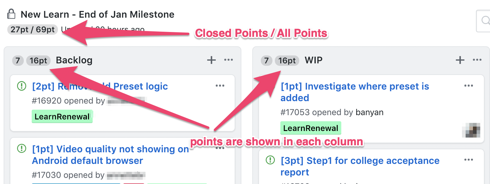
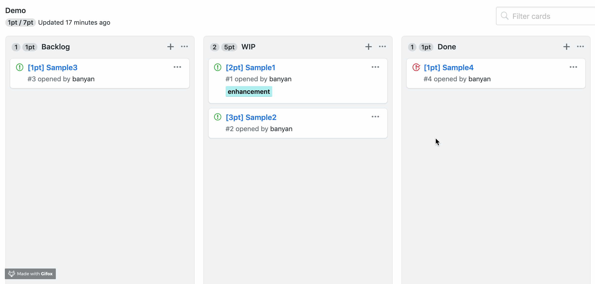

  
   
  <b>Chrome extension to move a card easily in GitHub Projects.</b>
  

### Install

- [**Chrome** extension][link-cws] [][link-cws]

### Usage

You need to create issue title stating with `[3pt]` this format and it will accumulate the number of points.

### Demo

You can try [demo project](https://github.com/banyan/github-story-points-sandbox/projects/1) after installed extension.

### License

MIT

[link-cws]: https://chrome.google.com/webstore/detail/github-story-points/fdhfdpafombnahpjjjcfopmehfofbdko "Version published on Chrome Web Store"
